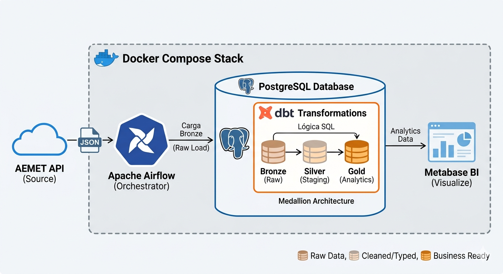

# AEMET Weather Data Pipeline (Medallion Architecture)

This project deploys a comprehensive data ecosystem designed to extract, transform, and visualize real-time meteorological data from the **AEMET API**. The primary focus is providing hourly forecasts for key sport climbing locations in Catalonia: **Siurana (Cornudella), Margalef, Arbolí, La Morera de Montsant, and Vilanova de Prades.**

The goal is to demonstrate the integration of modern **Data Engineering** tools under a fully dockerized **Medallion Architecture** (Bronze, Silver, Gold).

---

###  Architecture & Data Flow

The data flow follows an **End-to-End** journey designed to ensure data traceability and quality, orchestrated entirely within containers.




####   Data Layers (Medallion Architecture)
* **Bronze (Raw Layer):** An Airflow DAG extracts hourly data in JSON format, processes it with Pandas, and loads it via `TRUNCATE + INSERT` to preserve the "source of truth."
* **Silver (Staging Layer):** Using **dbt**, data types are cleaned, null values are handled (especially for critical temperatures), and columns are standardized.
* **Gold (Analytics Layer):** Final tables materialized by dbt featuring daily averages, rain probabilities, and sky conditions optimized for analytical consumption.

---

###  Visualization & Dashboards
An interactive **Metabase** dashboard has been designed to allow:

* **Advanced Filtering:** Slice data by Municipality, Date, and Specific Hour.

* **72-Hour Forecast Trends:** Detailed hourly tracking of:

* **Temperature & Thermal Sensation:** Monitoring real feel vs. actual degrees.

* **Humidity:** Hourly relative humidity percentages.

* **Precipitation:** Probability and volume of rainfall.

* **Sky Conditions:** Visual status of cloud coverage and weather states.


> 📁 **Note:** A file named `Metabase - Weather.pdf` is attached to this repository, showcasing the final dashboard visualization.

---

### 🛠️ Tech Stack
* **Orchestration:** Apache Airflow 2.10.
* **Transformation:** dbt-core 1.8+.
* **Database:** PostgreSQL 16.
* **Visualization:** Metabase BI.
* **Infrastructure:** Docker & Docker Compose (Linux/WSL2 Environment).

---

### 📂 Project Structure
```text
.
├── dags/
│   └── dag_aemet.py           # Extraction orchestration (Airflow)
├── dbt_project/               # dbt Project (Models and transformations)
│   ├── models/
│   │   ├── staging/           # Silver Layer: Cleaning and typing
│   │   └── analytics/         # Gold Layer: Final business tables
│   ├── profiles.yml.example   # Connection template (copy to profiles.yml)
│   └── dbt_project.yml        # General dbt configuration
├── postgres/
│   └── init.sql               # Schema initialization (raw, staging, analytics)
├── docker-compose.yaml        # Container orchestration
├── Dockerfile                 # Custom image (Airflow + dbt-postgres)
└── .env.example               # Template for AEMET API Key
```

---

### 🚀 Installation & Deployment

1.  **Clone the repository:**
    ```bash
    git clone https://github.com/VeroGI/aemet-data-pipeline.git
    cd aemet-data-pipeline
    ```

2.  **Configure credentials:**
    * Create a `.env` file based on `.env.example` with your `AEMET_API_KEY`.
    * Create the `dbt_project/profiles.yml` file based on `dbt_project/profiles.yml.example`.

3.  **Spin up infrastructure with Docker:**
    ```bash
    docker-compose up -d
    ```

4.  **Execute dbt (Initial Run):**
    ```bash
    docker exec -it airflow-webserver bash -c "cd /opt/airflow/dbt_project && dbt run"
    ```

---


***Acknowledgments & Inspiration***

This project was inspired by the work of [Attention Node](https://www.google.com/search?q=https://www.youtube.com/%40attentionnode), specifically their tutorial on building an [End-to-end ETL pipeline](https://www.youtube.com/watch?v=w9Ke-BMettc).

While the original project focused on UK city weather using the OpenWeatherMap API, this implementation adapts and evolves those core concepts by:

  * Integrating **dbt-core** for advanced SQL transformations (Medallion Architecture).
  * Connecting to the **AEMET API** for localized Spanish meteorological data.
  * Customizing the environment for rock climbing in my favourite spots.

-----